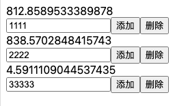
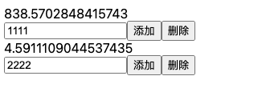

# Vue

## 微信下程序无法监听 [onShareAppMessage](https://developers.weixin.qq.com/community/develop/doc/0000447a5b431807af57249a551408?blockType=1&page=5)  事件的回调

> 指定监听到用户点击了分享， 但是是否分享出去无法监听到。
>
> 10月10日起新提交发布的版本，不再支持分享回调参数 success 、fail
> 、complete，即用户从小程序/小游戏中分享消息给好友时，开发者将无法获知用户是否分享完成，也无法在分享后立即获得分享成功后的回调参数shareTicket。该调整可以在基础库
> 2.3.0及以上版本体验。

## vue `v-for` 将 index 作为下标的隐患

> 虚拟DMO的 diff 算法

```html

<template>
    <div>
        <div v-for="(item,index) in list" :key="index">
            <div>{{item.name}}</div>
            <input type="input" placeholder="请输入"/>
            <button @click="handleAdd()">添加</button>
            <button @click="handleDelete(index)">删除</button>
        </div>
    </div>
</template>

<script>
    export default {
        data() {
            return {
                list: [],
            };
        },
        created() {
            this.handleAdd();
        },
        methods: {
            handleAdd() {
                let random = Math.random() * 1000;
                this.list.push({
                    id: random,
                    name: random
                })
            },
            handleDelete(i) {
                this.list.splice(i, 1)
            },
        }
    };
</script>
```



`**当我要删除一个元素时，会报如下错误：**`



**解决方法：**
> 原因是虚拟DOM在比较元素的时候，因为DOM上的key等属性均未发生变化，所以其自身和内部的input均被复用了。
>
>所以我们应该养成好习惯，不在实际开发过程中把index作为key值。

## openapi-ts-request

[openapi-ts-request](https://www.npmjs.com/package/openapi-ts-request)
> 一个基于 Vue3 的 OpenAPI 3.0,3.1 接口文档，支持 Swagger2.0/OpenAPI 3.0,3.1 接口文档。

### 安装

```bash
npm i openapi-ts-request --save-dev
```

### 使用

```javascript
// 在项目根目录下创建 openapi.ts 文件  文件名自定义

// 在 openapi.ts 文件中引入 openapi-ts-request
const {generateService} = require('openapi-ts-request')

generateService({
    // 接口文档地址
    schemaPath: 'http://127.0.0.1:4523/export/openapi/5?version=3.0',
    // 接口生成文件路径
    serversPath: './src/apis',
    // 接口前缀
    // apiPrefix: '/app',
    // request 导入路径
    requestImportStatement: 'import { request } from "../services/Apiservice"',
    // 是否将路径转换为驼峰命名 true: /app/user/list 转换为 appUserList  false: /app/user/list 转换为 app_user_list
    isCamelCase: !true,
    // 钩子函数
    hook: {
        // 自定义函数名
        customFunctionName(item) {
            const path = item.path.slice(1)
            const functionName = path.split('/').join('_');
            return functionName;
        }
    }
})

```

在 package.json 的 script 中添加命令: "openapi": "node xxx/xxx/openapi-ts-request.config.js"

```bash
npm run openapi
```

生成文件

```bash
src/apis/index.ts #接口入口文件
src/apis/types.ts #类型定义文件
src/apis/pet.ts #接口文件
```

## 基于 openapi-ts-request 的 request 请求封装

### 代码实例

```javascript
// apiRequest.ts

import axios, {AxiosRequestConfig, AxiosResponse, AxiosError} from "axios"


// 创建自定义错误类
export class ApiError extends Error {
    constructor(public

    status: number
,
    message: string
) {
    super(message);

    this
.
    name = 'ApiError';
    // 添加堆栈跟踪
    Error
.

    captureStackTrace(

    this
,
    ApiError
)
    ;
    // 在控制台输出错误信息
    console
.

    error(message);
}
}

// 定义 HTTP 方法类型
type
HttpMethod = 'GET' | 'POST' | 'PUT' | 'DELETE' | 'PATCH' |
    'get' | 'post' | 'put' | 'delete' | 'patch';

const Message = {
    success(message: string) {
        console.log(message)
    },
    error(message: string) {
        console.log(message)
    }
}

class Apiservice {
    private static instance: Apiservice
    private axiosInstance: any
    private baseURL: string

    private constructor() {
        // 默认的 baseURL（可以根据需要设置默认域名）
        this.baseURL = import.meta.env.VITE_APP_API_URL || "http://localhost:3000"

        // 创建一个 API 请求服务实例，设置通用配置
        this.axiosInstance = axios.create({
            baseURL: this.baseURL, // 初始化为默认域名
            timeout: 10000, // 请求超时时间
            headers: {
                'Content-Type': 'application/json'
            }
        })

        // 请求拦截器：在请求发出之前做一些处理
        this.axiosInstance.interceptors.request.use(
            (config: AxiosRequestConfig) => {
                const token = localStorage.getItem("token")
                if (token) {
                    config.headers = {
                        ...config.headers,
                        Authorization: `Bearer ${token}`
                    }
                }
                return config
            },
            (error) => {
                return Promise.reject(error)
            }
        )

        // 响应拦截器：对响应数据做处理（比如处理错误信息）
        this.axiosInstance.interceptors.response.use(
            (response: AxiosResponse) => {
                return response.data
            },
            (error: AxiosError) => {
                // @ts-ignore
                const errorMessage = error.response?.data?.message || error.message

                Message.error(errorMessage) // 错误提示
                return Promise.reject(errorMessage)
            }
        )
    }

    // 单例模式，确保只有一个 Apiservice 实例
    public static getInstance(): Apiservice {
        if (!Apiservice.instance) {
            Apiservice.instance = new Apiservice()
        }
        return Apiservice.instance
    }

    // 设置 baseURL（支持多个域名）
    public setBaseURL(baseURL: string): void {
        this.baseURL = baseURL
        this.axiosInstance.defaults.baseURL = baseURL
    }

    // 通用请求方法
    public async request<T>(
        method: HttpMethod,
        url: string,
        data

?:
    any
,
    showMessage: { success?: boolean; error?: boolean } = {success: false, error: false}
,
    config: AxiosRequestConfig = {}
):

    Promise<T> {
        try {
            const response = await this.axiosInstance({
                method: method.toUpperCase(),
                url,
                data,
                ...config,
            })

            // 成功提示
            if (showMessage.success && response?.message) {
                Message.success(response.message)
            }

            return response
        } catch (error) {
            // 错误提示
            if (error.response) {
                const {status, data} = error.response;
                const errorMessage = data.message || '请求失败';
                ResponseHandler.handleBusinessError(status, errorMessage);
                throw new ApiError(status, errorMessage);
            }
            ResponseHandler.handleNetworkError();
            throw new ApiError(500, '网络错误');
        }
    }

    // 封装 get 请求
    public get<T>(
        url: string,
        showMessage: { success?: boolean; error?: boolean } = {success: false, error: false},
        config: AxiosRequestConfig = {}
    ): Promise<T> {
        return this.request < T > ("get", url, undefined, showMessage, config)
    }

    // 封装 post 请求
    public post<T>(
        url: string,
        data: any,
        showMessage: { success?: boolean; error?: boolean } = {success: false, error: false},
        config: AxiosRequestConfig = {}
    ): Promise<T> {
        return this.request < T > ("post", url, data, showMessage, config)
    }

    // 封装 put 请求
    public put<T>(
        url: string,
        data: any,
        showMessage: { success?: boolean; error?: boolean } = {success: false, error: false},
        config: AxiosRequestConfig = {}
    ): Promise<T> {
        return this.request < T > ("put", url, data, showMessage, config)
    }

    // 封装 delete 请求
    public delete<T>(
        url: string,
        showMessage: { success?: boolean; error?: boolean } = {success: false, error: false},
        config: AxiosRequestConfig = {}
    ): Promise<T> {
        return this.request < T > ("delete", url, undefined, showMessage, config)
    }

    // 封装 patch 请求
    public patch<T>(
        url: string,
        data: any,
        showMessage: { success?: boolean; error?: boolean } = {success: false, error: false},
        config: AxiosRequestConfig = {}
    ): Promise<T> {
        return this.request < T > ("patch", url, data, showMessage, config)
    }
}


// 导出一个便捷的 request 函数
export const request =
<
T > (
    url: string,
    config
:
{
    method: HttpMethod;
    data ? : any;
    headers ? : Record < string, string >;
    showMessage ? : {success? : boolean; error? : boolean};
    [key
:
    string
]:
    any;
}
):
Promise < T >
=>
{
    const {method, data, headers, showMessage = {success: false, error: true}, ...rest} = config;

    return Apiservice.getInstance().request < T > (
        method,
            url,
            data,
            showMessage,
            {headers, ...rest}
    );
}
;


export default Apiservice

/**

 // 切换到域名 1
 import Apiservice from "@/services/apiRequest";

 Apiservice.getInstance().setBaseURL("https://api.domain1.com");

 export const getUserInfo = (userId: string) => {
 return Apiservice.getInstance().get(`/user/${userId}`, { success: false, error: true });
 };


 // 切换到域名 2
 import Apiservice from "@/services/apiRequest";

 Apiservice.getInstance().setBaseURL("https://api.domain2.com");

 export const getProductList = () => {
 return Apiservice.getInstance().get("/products", { success: false, error: true });
 };
 */


// request('/app/student/add', {
//   method: 'POST',
//   data: {
//     userName: '张三',
//     userAge: 18,
//     userSex: '男',
//     userPhone: '13800138000',
//     userEmail: 'zhangsan@163.com',
//     userAddress: '北京市海淀区',
//   },
//   showMessage: {
//     success: true,
//     error: true,
//   },
// })

```

### 相应错误 code 码单独处理

```javascript
import alertMessage from '@/core/plugin/toast';

export class ResponseHandler {
    static handleAuthError() {
        localStorage.removeItem('token');
        alertMessage.alert('登录已超时，请重新登录');
        window.location.reload();
    }

    static handleForbidden() {
        alertMessage.alert('没有权限访问该资源');
    }

    static handleNotFound() {
        alertMessage.alert('请求的资源不存在');
    }

    static handleServerError() {
        alertMessage.alert('服务器错误');
    }

    static handleNetworkError() {
        alertMessage.alert('网络错误，请检查网络连接');
    }

    static handleBusinessError(code: number, message: string) {
        switch (code) {
            case 401: // 登录超时
                this.handleAuthError();
                break;
            case 403: // 没有权限访问该资源
                this.handleForbidden();
                break;
            case 404: // 请求的资源不存在
                this.handleNotFound();
                break;
            case 500: // 服务器错误
                this.handleServerError();
                break;
            case -999: // 登录超时
                this.handleAuthError();
                break;
            // 可以添加其他业务错误码处理
            default:
                alertMessage.alert(message);
        }
    }
}
```

## vue3-select-component

[vue3-select-component](https://www.npmjs.com/package/vue3-select2-component)
> 一个基于 Vue3 的多选组件，支持单选、多选、远程搜索、分组、标签展示、自定义标签、自定义样式、自定义选项等。

通过 `patch-package` 适配  [下载 patch-package包](/docs/public/patches.zip)

## 单元测试

[Vitest](https://cn.vitest.dev/)
> Vitest 是一个 Vite 插件，它使用 Vite 的编译器来执行测试。

```bash
npm install -D vitest
```

`package.json` 执行测试命令

```bash
"scripts": {
    "test": "vitest"
}
```

`vitest.config.ts`

```javascript
import {fileURLToPath} from 'node:url'
import {mergeConfig, defineConfig, configDefaults} from 'vitest/config'
import viteConfig from './vite.config'

export default mergeConfig(
    viteConfig,
    defineConfig({
        test: {
            environment: 'jsdom',
            exclude: [...configDefaults.exclude, 'e2e/**'],
            root: fileURLToPath(new URL('./', import.meta.url))
        }
    })
)

```

方法测试

```javascript
import {describe, it, expect} from 'vitest'
import {add} from '../src/utils/math'

describe('add', () => {
    it('adds 1 + 2 to equal 3', () => {
        expect(add(1, 2)).toBe(3)
        expect(add(2, 2)).toBe(4)
    }
}
```

组件测试

```bash
npm install -D @vue/test-utils
```

组件测试实例

```javascript
import {mount} from '@vue/test-utils'
import HelloWorld from './components/HelloWorld.vue'

describe('HelloWorld.vue', () => {
    it('renders props.msg when passed', () => {
        const msg = 'new message'
        const wrapper = mount(HelloWorld, {
            props: {msg}
        }
        expect(wrapper.text()).toMatch(msg)
    }
}
```

## 全局组件安装

> components.ts 声明组件

```javascript
import type {App} from 'vue'
import HelloWorld from '@/components/HelloWorld.vue'

const components = [
    HelloWorld,
    // ...
]

export function initComponents(app: App) {
    components.forEach(component => {
        app.component(component, component)
    }
}
```

```javascript
import initComponents from '@/core/helpers/components'

// main.ts 
import {createApp} from 'vue'

const app = createApp(App)
initComponents(app);
```

## pinia 状态管理

[pinia](https://pinia.vuejs.org/)
> Pinia 是一个轻量级的 Vue 状态管理库，它使用 Proxy 语法来创建响应式状态，并使用 TypeScript 的类型推断来提供类型安全。

```bash
npm install pinia
```

```javascript
// 初始化pinia
import initPinia from '@/core/helpers/pinia';

const app = createApp(App);
initPinia(app);
```

初始化pinia

```javascript
import {createPinia} from 'pinia'
import piniaPluginPersistedstate from 'pinia-plugin-persistedstate'

const pinia = createPinia()

export function initPinia(app: App) {
    pinia.use(piniaPluginPersistedstate)
    app.use(pinia)
}
```

```javascript
import {defineStore} from 'pinia'
import {ref} from 'vue'

export const useStore = defineStore('main', () => {
        const someState = ref('你好 pinia')
        return {someState}
    },
    {
        persist: true,
    },
)
```

## 地址智能识别

[smartParsePro](https://github.com/wzc570738205/smartParsePro)
> 智能识别收货地址（支持省市区县街道/姓名/电话/邮编识别）
> 安装使用

```bash
npm install address-smart-parse
```

```javascript
import smart from 'address-smart-parse'

smart("陕西省西安市雁塔区太白路西段1号 刘三娘 13590000018 211381000012096810")

```

返回格式：

```js
{
    province: 陕西省
    provinceCode: 61
    city: 西安市
    cityCode: 6101
    county: 雁塔区
    countyCode: 610113
    address: 太白路西段1号
    name: 刘三娘
    phone: 11381000012
}
```

