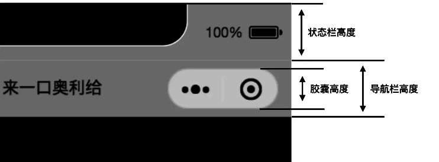

## 微信小程序胶囊 
>上面用到的 containerHeight 和 bottomHeight 这两个值是在 app 内配置的全局变量，也具体看看如何得到的吧，这里也把其他一些值写出来，后面博客可能会用到。

```js
globalData: {
    //系统信息
    systemInfo: {},
    //1px像素值 对应 rpx
    pixelRatio1: 2,
    //胶囊信息
    menuInfo: {},
    //屏幕高度
    screenHeight: 2000,
    //顶部高度 = 状态栏高度 + 导航栏高度
    topHeight: 0,
    //状态栏高度
    statusHeight: 0,
    //导航栏高度
    naviHeight: 0,
    //底部安全高度
    bottomHeight: 0,
},
      
onLaunch: function () {
    var that = this;

    //获取设备信息
    let systemInfo = wx.getSystemInfoSync()
    that.globalData.systemInfo = systemInfo

    //1rpx 像素值
    let pixelRatio1 = 750 / systemInfo.windowWidth;
    that.globalData.pixelRatio1 = pixelRatio1

    //胶囊信息
    let menu = wx.getMenuButtonBoundingClientRect()
    that.globalData.menuInfo = menu

    //状态栏高度
    let statusHeight = systemInfo.statusBarHeight
    that.globalData.statusHeight = statusHeight * pixelRatio1

    //导航栏高度
    let naviHeight = (menu.top - statusHeight) * 2 + menu.height
    that.globalData.naviHeight = naviHeight * pixelRatio1

    //顶部高度 = 状态栏高度 + 导航栏高度
    that.globalData.topHeight = (statusHeight + naviHeight) * pixelRatio1

    //屏幕高度
    let screenHeight = systemInfo.screenHeight
    that.globalData.screenHeight = screenHeight * pixelRatio1

    //底部高度 = 屏幕高度 - 安全区域bottom
    let bottom = systemInfo.safeArea.bottom
    that.globalData.bottomHeight = (screenHeight - bottom) * pixelRatio1
}

```
这里导航栏高度要说明一下，具体看下图，用胶囊顶部绝对高度减去状态栏高度得到一个小差值，这个差值的两倍加上胶囊的高度就是导航栏的高度了，应该不难，自定义导航栏的时候还是可以用到的。




## 微信小程序方法封装

[点击下载mini_core.zip包](https://aweixin.github.io/lib/mini_core.zip)

## 微信小程序 别名配置
> 跟目录 app.json 中 配置

```js
      {
            "resolveAlias": {
                  "~/*": "/*",
                  "~/origin/*": "origin/*",
            }
      }
```

## 微信小程序下载文件视频，图片

```js
//downloadSaveFile.js
/** 
const DownloadSaveFile = require('downloadSaveFile.js');

downloadSaveFile(e) {
  let url = e.currentTarget.dataset.url;
  DownloadSaveFile.downloadFile('video', url); //video或image
}

*/
/**
 * 下载单个文件
 * @param {string} [type]
 * @param {string} url
 * @callback successCallback
 * @callback failCallback
 */
function downloadFile(type, url, successc, failc) {
  checkAuth(() => {
    wx.showLoading({
      title: '正在下载',
      mask: true
    })
    downloadSaveFile(
      type,
      url,
      () => {
        wx.hideLoading();
        wx.showToast({
          title: '下载成功',
          icon: 'none',
        })
        successc && successc();
      },
      (errMsg) => {
        wx.hideLoading();
        wx.showToast({
          title: errMsg,
          icon: 'none',
        })
        failc && failc();
      }
    );
  })
}

/**
 * 下载多个文件
 * @param {string} [type]
 * @param {string[]} urls
 * @callback completeCallback
 */
function downloadFiles(type, urls, completec) {
  let success = 0;
  let fail = 0;
  let total = urls.length;
  let errMsgs = [];

  checkAuth(() => {
    wx.showLoading({
      title: '正在下载',
      mask: true
    })
    for (let i = 0; i < urls.length; i++) {
      downloadSaveFile(
        type,
        urls[i],
        () => {
          success++;
          if (success + fail === total) {
            saveCompleted(success, fail, completec, errMsgs);
          }
        },
        (errMsg) => {
          fail++;
          errMsg && errMsgs.push(`视频${i}${errMsg}`);
          if (success + fail === total) {
            saveCompleted(success, fail, completec, errMsgs);
          }
        }
      );
    }
  })
}

//保存完成
function saveCompleted(success, fail, completec, errMsgs) {
  wx.hideLoading();
  let errMsg = '无';
  if (errMsgs.length) {
    errMsg = errMsgs.join('\n');
  }

  wx.showModal({
    title: `成功${success}项，失败${fail}项`,
    content: `失败信息:\n${errMsg}`,
    showCancel: false,
    success(res) {
      if (res.confirm) {
        completec && completec();
      }
    }
  })
}

//下载文件
function downloadSaveFile(type, url, successc, failc) {
  wx.downloadFile({
    url: url,
    success: res => {
      if (res.statusCode === 200) {
        if (type === 'video') {
          //类型为视频
          wx.saveVideoToPhotosAlbum({
            filePath: res.tempFilePath,
            success: res => {
              successc && successc();
            },
            fail: res => {
              failc && failc('保存失败');
            }
          })
        } else if (type === 'image') {
          //类型为图片
          wx.saveImageToPhotosAlbum({
            filePath: res.tempFilePath,
            success: res => {
              successc && successc();
            },
            fail: res => {
              failc && failc('保存失败');
            }
          })
        }
      } else {
        failc && failc('状态码非200');
      }
    },
    fail: res => {
      failc && failc('下载失败');
    }
  })
}

//检查权限
function checkAuth(gotc) {
  //查询权限
  wx.showLoading({
    title: '检查授权情况',
    mask: true
  })
  wx.getSetting({
    success(res) {
      wx.hideLoading();
      if (!res.authSetting['scope.writePhotosAlbum']) {
        //请求授权
        wx.authorize({
          scope: 'scope.writePhotosAlbum',
          success() {
            //获得授权，开始下载
            gotc && gotc();
          },
          fail() {
            wx.showModal({
              title: '',
              content: '保存到系统相册需要授权',
              confirmText: '授权',
              success(res) {
                if (res.confirm) {
                  wx.openSetting({
                    success(res) {
                      if (res.authSetting['scope.writePhotosAlbum'] === true) {
                        gotc && gotc();
                      }
                    }
                  })
                }
              },
              fail() {
                wx.showToast({
                  title: '打开设置页失败',
                  icon: 'none',
                })
              }
            })
          }
        })
      } else {
        //已有授权
        gotc && gotc();
      }
    },
    fail() {
      wx.hideLoading();
      wx.showToast({
        title: '获取授权失败',
        icon: 'none',
      })
    }
  })
}

module.exports = {
  downloadFile,
  downloadFiles
};
```

## 微信小程序处理HTML标签图片自适应

```js
/**
 * 处理富文本里的图片宽度自适应
 * 1.去掉img标签里的style、width、height属性
 * 2.修改所有style里的width属性为max-width:100%
 * 3.img标签添加style属性：max-width:100%;height:auto
 * 4.去掉<br/>标签
 * @param html
 * @return string
 */
function formatRichText(html) {
    // 去掉img标签里的style、width、height属性
    let newContent = html.replace(/]*>/gi, function(match, capture) {
        match = match.replace(/style="[^"]+"/gi, '').replace(/style='[^']+'/gi, '');
        match = match.replace(/width="[^"]+"/gi, '').replace(/width='[^']+'/gi, '');
        match = match.replace(/height="[^"]+"/gi, '').replace(/height='[^']+'/gi, '');
        return match;
    });
    // 修改所有style里的width属性为max-width:100%
    newContent = newContent.replace(/style="[^"]+"/gi, function(match, capture) {
        match = match.replace(/width:[^;]+;/gi, 'max-width:100%;').replace(/width:[^;]+;/gi, 'max-width:100%;');
        return match;
    });
    // 去掉<br/>标签
    // newContent = newContent.replace(/<br[^>]*\/>/gi, '');
    // img标签添加style属性：max-width:100%;height:auto
    newContent = newContent.replace(/\ 拷贝到小程序根目录下的grace目录,并命名为index.js
2. 创建页面时用`grace.page` 替换 `Page` 即可。

## 微信小程序接口封装

```js
const host = 'host';
// 小程序请求接口
export default {
	init:`/api/init`
}
```

## 授权拒绝

> 微信小程序授权拒绝之后解决方法

```js
    saveImageToPhotosAlbum(option) {
        return new Promise((resolve, reject) => {
            wx.saveImageToPhotosAlbum({
                ...option,
                success: resolve,
                fail: reject,
            })
        })
    },
    save() {
        var that = this;
        this.saveImageToPhotosAlbum({
            filePath: that.data.previewImageUrl
        }).then(() => {
            wx.showToast({
                icon: 'none',
                title: '分享图片已保存至相册',
                duration: 2000
            })
        }).catch((err) => {
            console.log(err)
            let errMsg = err.errMsg
            let msg = ''
            if (errMsg === "saveImageToPhotosAlbum:fail:auth denied" || errMsg === "saveImageToPhotosAlbum:fail auth deny" || errMsg === "saveImageToPhotosAlbum:fail authorize no response") {
                // 这边微信做过调整，必须要在按钮中触发，因此需要在弹框回调中进行调用
                that.imageErrorAuth()
            } else {
                msg = '保存失败'
            }
            if (msg) {
                wx.showToast({
                    title: msg,
                    icon: 'none',
                    duration: 2000
                })
            }
        })
    },
    imageErrorAuth() {
        // 授权失败 提示授权操作
        wx.showModal({
            title: '提示',
            content: '需要您授权保存至相册',
            showCancel: false,
            success: modalSuccess => {
                wx.openSetting({
                    success(settingData) {
                        console.log("settingData", settingData)
                        if (settingData.authSetting['scope.writePhotosAlbum']) {
                            wx.showModal({
                                title: '提示',
                                content: '获取权限成功,再次保存图片即可',
                                showCancel: false
                            })
                        } else {
                            wx.showModal({
                                title: '提示',
                                content: '获取权限失败，将无法保存到相册',
                                showCancel: false
                            })
                        }
                    },
                    fail(failData) {
                        console.log("failData", failData)
                    },
                    complete(finishData) {
                        console.log("finishData", finishData)
                    }
                })
            }
        })
    },
```

## 微信小程序 new Date()

> 微信小程序 new Date() 方法在iOS设备上无效的问题的解决方法

```js
    let date = "2021-01-04 00:00"
    let now = new Date(date.replace(/-/g,'/'))
```

## 小程序分包加载

### 1.1 小程序的限制

1. 正常情况下，小程序对代码包的限制是：大小不超过 2M，超过这个大小无法预览，也无法上传代码
2. 做了分包加载的情况下，限制是：每个包大小不超过 2M，所有包总共的大小不超过 16M。

### 1.2 按照逻辑划分项目页面

```js
// tabBar(放入主包)
"pages/index/index",
"pages/logs/logs"

// packageA(分包)
"packageA/parent/parent",
"packageA/child/child"
```

### 1.3 在 app.json 中配置路径

配置一个 subpackages 属性，值为一个数组。 数组中的每个对象都是一个分包。 每个分包中，需要配置几个属性：

1. root: 这个分包的根路径
2. Pages: 这个分包中的页面路径，其中页面路径为分包根路径的相对路径

```js
{
  "pages": [
    "pages/index/index",
    "pages/logs/logs"
  ],
    "subpackages": [
    {
      "root": "packageA",
      "pages": [
        "child/child",
        "parent/parent"
      ]
    }
  ],
}
```

### 1.4 保存页面后，生成对应的文件目录

配置完 app.json 文件，保存后，会发现自动生成了对应目录

### 1.5 项目中使用路径

到了这一步，其实分包已经配置完成了，但是还有一个问题需要解决： 更改项目中的引用路径，如： 原来引用的路径是这样的

```js
gotoChild() {
    wx.navigateTo({
      url: '/pages/child/child',
    })
}
```

需要更改成最新路径：

```js
gotoChild() {
    wx.navigateTo({
      url: '/packageA/child/child',
    })
}
```
